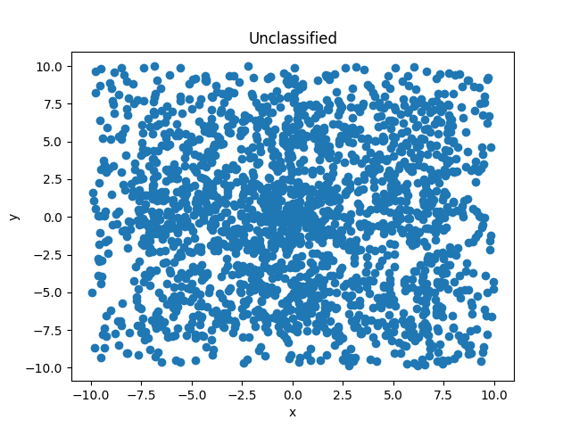
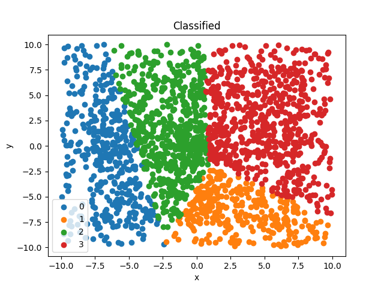

# Zpracování dat s použitím MPI
* Autoři práce: Kálecký, Naiman
## Zadání
Vaším úkolem je vytvořit aplikaci, která demonstruje efektivní využití MPI rozhraní při zpracování většího množství dat.
Mějme N mračen dvourozměrných bodů. Úkolem aplikace je klasifikovat jednotlivé body do klasifikačních N tříd a to na základně vzdálenosti od etalonů klasifikařních tříd. (Etalon je reprezentativní fiktivní bod, který bude ve “středu” klasifikační třídy).
## Spuštění programu, příklad
``` 
   mpiexec -n 4 python3 DPG.py
```
* 4 označuje počet N, program generuje N mračen o 500 bodech  
* každý z procesorů má set svých 500 bodů  

* jednotlivé procesory pak klasifikují body dle vzdálenosti bodů  
 
## Metodika
* nultý procesor nejprve vygeneruje N fiktivních bodů - etalonů  
* etalony rozešle i všem ostatním  
* každý procesor si vygeneruje 500 bodů kolem jednoho z etalonů  
* pozice bodů se sesbírají, procesor 0 pak vykreslí graf neklasifikovaných bodů, ukládá jej do souboru PNG  
* následně se provádí klasifikace bodů dle nejnižší geometrické vzdálenosti  
* každý procesor pracuje se svým souborem bodů a testuje je s celým souborem etalonů  
* při nalezení kratší vzdálenosti bod přiřadí k dané skupině  
* nakonec dochází k sesbírání všech bodů a jejich skupin  
* následuje opět vykreslení po skupinách a uložení grafu do PNG  
## Knihovny
* vykreslování grafů zajišťuje knihovna matplotlib  
* MPI využíváme za pomoci knihovny mpi4py  
* program běží na Pythonu 3.8
* dále importujeme numpy, math, random
